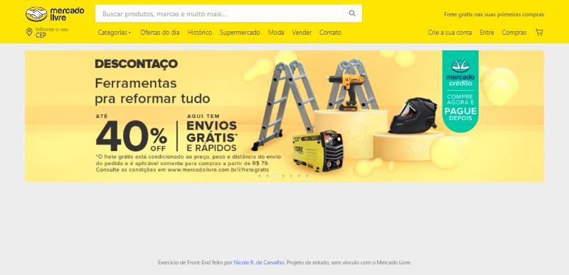
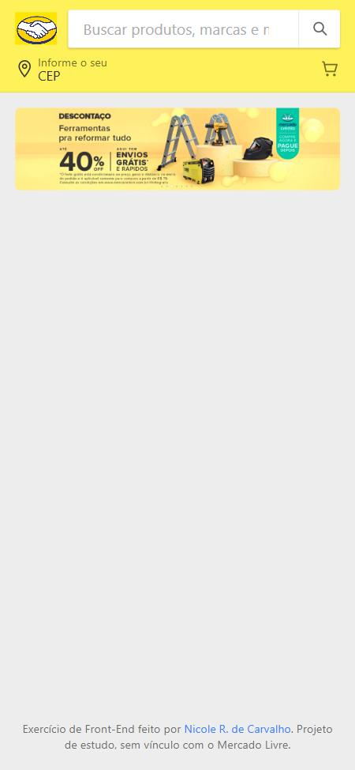

# 🛒 Protótipo do cabeçalho do Mercado Livre

Recriação do **cabeçalho do Mercado Livre** com **HTML e CSS puros**, feita como atividade individual de Front-End. O foco é reproduzir o layout com Flexbox e fazer ele se adaptar do computador ao celular.

<p align="center">
  
</p>

## ✨ O que tem

- 🏷️ Logo, **campo de busca** com botão de lupa e texto promocional
- 📍 Atalho **"Informe o seu CEP"**
- 🧭 Menu de **categorias** (Categorias, Ofertas do dia, Histórico, Moda, Vender…)
- 👤 Atalhos da **conta** e **carrinho**
- 🖼️ Banner promocional que se ajusta à largura da tela
- 📱 **Responsivo em três tamanhos:** no tablet alguns itens do menu somem; no celular ficam só o ícone do logo, a busca, o CEP e o carrinho

<p align="center">
  
</p>

## 🧠 Decisões técnicas

- **Flexbox em vez de posição absoluta:** a busca antes usava `position: absolute` com porcentagens e saía do lugar ao mudar o tamanho da janela. Agora cada linha do cabeçalho é um `flex` e a busca ocupa o espaço que sobra (`flex: 1`).
- **Ícones em SVG inline:** lupa, localização e carrinho são desenhados no próprio HTML e herdam a cor do texto (`currentColor`). Substituem um SVG de 1.244 pt e um PNG.
- **Imagens locais:** o banner que era carregado direto do servidor do Mercado Livre foi trocado pelo que já estava no repositório.
- **HTML válido e semântico:** `header`, `nav` com `aria-label`, `form role="search"` e rótulo para o campo de busca.

## 🛠️ Tecnologias

HTML · CSS (Flexbox, variáveis CSS, media queries) · SVG

## 📁 Estrutura

```
index.html       → estrutura do cabeçalho e do banner
css/style.css    → layout e responsividade
img/             → logo e banner
```

## 🚀 Como executar

Baixe o repositório e abra o `index.html` no navegador.

> Projeto de estudo, sem vínculo com o Mercado Livre. A marca e as imagens pertencem aos seus donos.
